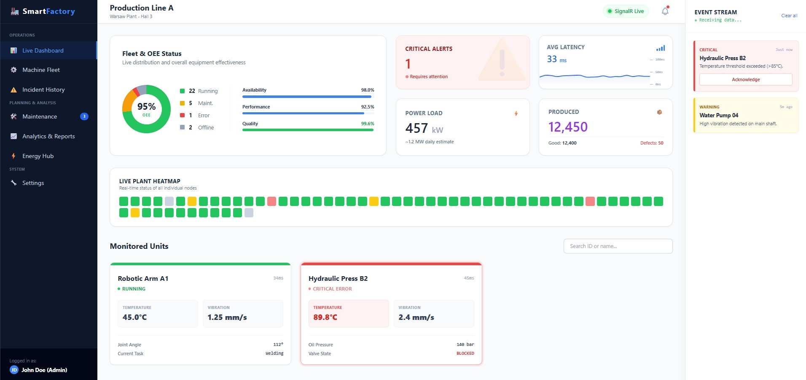
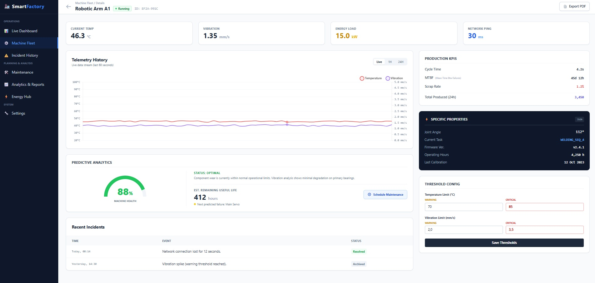
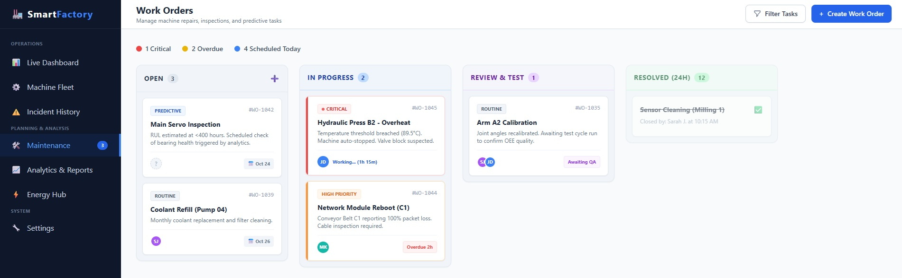
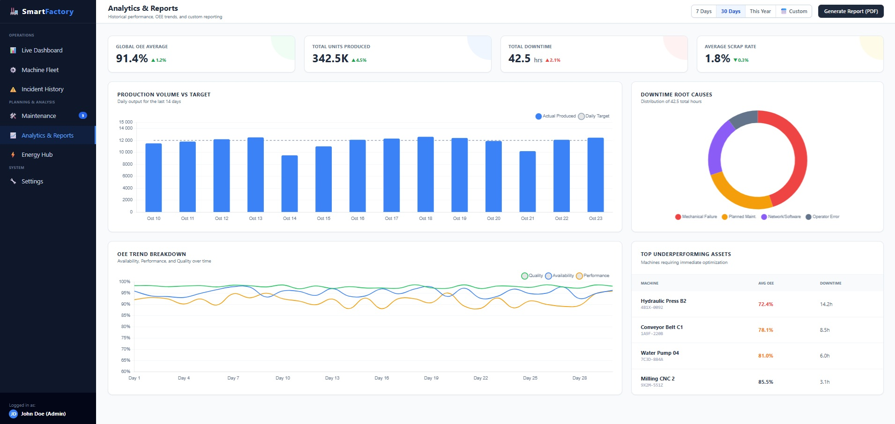
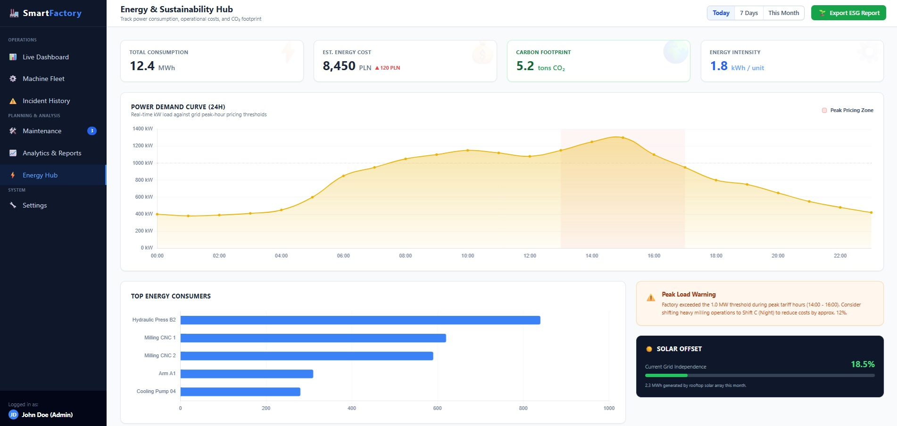

# 🏭 Smart Factory CMMS (Computerized Maintenance Management System)

> 🚧 **Status: In Progress** > This project is currently under active development.

## Target User Interface (Mockups)
> *Note: These are the target HTML/Tailwind mockups that are currently being integrated into the React application.*

### Main Dashboard

### Machine Details

### Maintenace

### Analytics Data

### Energy Consumption Data 

---

## 📖 About The Project
Smart Factory CMMS is a full-stack web application designed to manage manufacturing equipment, track real-time machine telemetry, and organize maintenance workflows. It bridges the gap between hardware monitoring (simulated IoT data) and human maintenance teams through an intuitive, interactive dashboard.

The system is built with a strongly decoupled architecture: a high-performance **RESTful API** on the backend and a fast, responsive **Single Page Application (SPA)** on the frontend.

## 🛠️ Tech Stack
**Backend (Web API):**
- **Language/Framework:** C# 12, .NET 8.0, ASP.NET Core
- **Database & ORM:** SQL Server, Entity Framework Core 8
- **Architecture:** REST API, Dependency Injection, Controller-based routing
- **Features:** Data Annotations, Change Tracking, Concurrency handling, Data Seeding

**Frontend (SPA):**
- **Framework:** React 18 (initialized with Vite)
- **Styling:** Tailwind CSS
- **Routing:** React Router (Planned)
- **Data Fetching:** Fetch API / Asynchronous JavaScript

## ✨ Key Features (Implemented & Planned)

### ✅ Currently Implemented:
- **Database Architecture:** Fully designed SQL Server schema using EF Core Code-First migrations.
- **Data Seeding:** Automated population of initial test data (Facilities, Work Shifts, Admin Users, and Machine fleets).
- **Machine Management API:** CRUD operations for industrial machines (GET, POST, PUT, DELETE) with Soft-Delete implementation.
- **CORS Configuration:** Secure cross-origin resource sharing configured between the .NET backend and Vite development server.
### ⏳ Work In Progress / Upcoming:
- **Work Order Kanban Board:** Drag-and-drop interface for managing maintenance tickets and incidents.
- **Real-time Telemetry (SignalR):** Background workers simulating live machine data (temperature, vibration) pushed to the frontend via WebSockets.
- **Dashboard Analytics:** Interactive charts (e.g., Recharts/Chart.js) displaying OEE (Overall Equipment Effectiveness) and energy consumption.
- **Predictive Maintenance:** Simple logic to trigger automatic alerts based on predefined metric thresholds.
- **Frontend Foundation:** React app connected to the API, displaying a responsive grid of machines fetched directly from the database.

## 🚀 How to Run Locally

### Prerequisites:
- [.NET 8 SDK](https://dotnet.microsoft.com/download/dotnet/8.0)
- [Node.js](https://nodejs.org/)
- SQL Server (LocalDB or full instance)

### Backend Setup:
1. Navigate to the API directory: `cd api` (or your backend folder name)
2. Update the `DefaultConnection` string in `appsettings.json` if necessary.
3. Apply database migrations: `dotnet ef database update`
4. Run the API: `dotnet run` (Swagger UI will be available to explore endpoints).

### Frontend Setup:
1. Navigate to the UI directory: `cd ui` (or your frontend folder name)
2. Install dependencies: `npm install`
3. Start the development server: `npm run dev`

## License
This project is open source. See LICENSE file for details.
